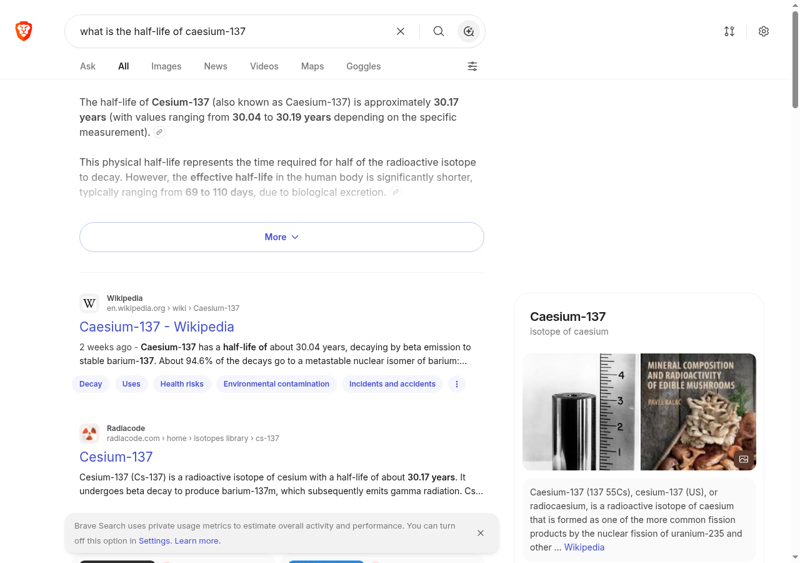

# Protocol — inline citation density in the smaller answer engines

**Why this exists.** Chapter `02 · The Engines` used to say that You.com, Brave and Arc *"tend to
place numbered inline citations on nearly every answer"*, on the authority of a comparison blog.
The vendors' own documentation does not support the sentence (checked 2026-09-04: You.com documents
`sources` in its Research API, not the consumer product; Brave's Leo page says nothing about
citations; Arc's page says nothing about attribution). A product behaviour that no primary source
describes has to be observed, not cited. This protocol is the observation, and the chapter now
says what was observed — with its date and its limits — instead of what the blog said.

## What is measured

One binary variable per engine per query: **does the generated answer show at least one inline
citation marker — a numeral, superscript or chip inside the answer text that leads to a source
URL?** Yes or no. Not how many, not whether they are correct. Noted separately, not scored: whether
sources appear only as a list under the answer (a list at the end does not tie a claim to a source
the way an inline marker does).

## Engines

1. **You.com** — default answer mode.
2. **Brave Search** — the AI answer on `search.brave.com` (`summary=1`). Leo, the browser assistant,
   is a Brave-browser feature and is not observable from a plain Chromium.
3. **Arc** — Arc Search / *Browse for me*: a macOS / Windows / iOS client. No Linux client.
4. **Claude with web search** — for the chapter's separate claim that *when* Claude cites, the
   citation is a clickable URL.

An engine that cannot be observed under the rules below is recorded as **not observed** and the
chapter does not describe it.

## Queries

Six, fixed before any result was seen. Three factual, two matters of opinion, one event:

1. `what is the half-life of caesium-137`
2. `who won the 2022 Fields Medal`
3. `how does HTTP/3 differ from HTTP/2`
4. `is intermittent fasting effective for weight loss`
5. `best programming language for data science`
6. `what happened in the Suez Canal blockage`

## Procedure

1. **Clean session:** a new browser context per query — no cookies, no login, no history.
   Personalisation changes the answer.
2. Every engine gets the six queries in the same order, **one pass each**. This describes what
   the product does on one day; repeating it would not make it a population estimate.
3. Per answer: `engine | query | inline marker yes/no | sources only below yes/no | note`, plus
   the timestamp with time zone at the start and end of each engine, and one screenshot per engine
   of the first query.

## Observation of 2026-09-13

Start / end: **21:06 / 21:07 UTC**. Location: Spain (a server, datacenter IP). Chromium 128 driven
through the DevTools protocol; a fresh incognito-style context per query.

| engine | q1 | q2 | q3 | q4 | q5 | q6 | inline / observed |
|---|---|---|---|---|---|---|---|
| Brave Search, AI answer | yes (3) | yes (7) | yes (12) | yes (6) | yes (5) | yes (4) | **6 / 6** |
| You.com | — | — | — | — | — | — | not observed: `/search` redirects to `/signin` in a clean session |
| Arc | — | — | — | — | — | — | not observed: no Linux client |
| Claude with web search | — | — | — | — | — | — | not observed: requires an account, which the clean-session rule excludes |

Numbers in parentheses are inline markers counted in the DOM of the answer block
(`button.inline-citation` inside `.llm-output`). All six Brave answers also carried a **sources
list under the answer** (both forms at once, not one or the other).

**Limits of this pass, stated so nobody over-reads it:**

- The Brave marker is a link-icon **button** that opens the source on click; it carries no `href`
  in the page source. Its click-through was recorded by the run script but **not re-verified by
  eye**, because two follow-up requests for query 1, minutes after the pass, returned **no AI
  answer at all** — the same query, the same clean context. Whether that was throttling after eight
  requests from one IP or ordinary variance, it means *"nearly every answer"* is not a stable
  property of the product; it is what one pass saw.
- One pass, one location, one day. These products change without notice; the chapter says so.
- For Claude, the chapter's claim is now sourced to Anthropic's own documentation of the web
  search tool (citations with source URL, title and cited text) rather than to a blog; this
  protocol did not observe the product.

## Observation of 2026-09-21 — the noise floor, and what it turned out to be

The 13 Sep pass said, in its own limits, that *"nearly every answer"* is not a stable property of the
product; it is what one pass saw. This is the pass that measures how unstable. Same six queries, same
order, same conditions, a **fresh browser context per query**, run twice **an hour apart** — which is
what `PROTOCOL.md` §7 of the Cookbook requires before any before/after comparison is readable.

| query | pass A (10:27Z) | pass B (11:30Z) | pass C (12:33Z) |
|---|---|---|---|
| half-life of caesium-137 | inline, 1 marker | inline, 1 marker | **no AI answer** |
| 2022 Fields Medal | inline, 2 | inline, 1 | **no AI answer** |
| HTTP/3 vs HTTP/2 | inline, 1 | inline, 3 | **no AI answer** |
| intermittent fasting | inline, 1 | **answer, 0 markers** | **no AI answer** |
| best language for data science | inline, 4 | **no AI answer** | **no AI answer** |
| Suez Canal blockage | inline, 2 | **no AI answer** | **no AI answer** |

Read naively, the protocol's binary variable — *does the answer carry at least one inline citation
marker* — changes in **3 of 6 queries**, which would be a 50% noise floor and would make the engine
unusable as an instrument. Two controls, run immediately after, say that reading is wrong.

**Control 1 — position.** The two queries that returned nothing were the last two of the pass, so they
were re-asked **alone and first**. Both still returned no AI answer. Position within the pass is not
the cause.

**Control 2 — the address.** A query that *had* answered in both passes (caesium-137) was then asked on
its own. It returned **no AI answer either**. So at that moment the engine was not answering this
address at all: the two blanks in pass B are the quota of a datacenter IP running out, not the product
deciding to stop citing.

**What the measurement actually is, then.** Among the four queries where the engine answered in both
passes, the binary variable flipped **once** — intermittent fasting, which carried an inline marker in
pass A and an answer with none in pass B. One flip in four comparable observations. Marker *counts*
moved on three of four (2→1, 1→3, 1→0), which is why the protocol scores the binary and treats counts
as secondary.

**The finding that matters more than the number.** This engine cannot be measured repeatedly from a
single datacenter address: the quota runs out within an hour of ordinary use, and **a query the engine
declines to answer looks exactly like a query it answered without citing**. Any study that scores a
missing answer as "no citation" will manufacture an effect out of its own rate limit. The design
consequence, for this protocol and for the Cookbook's: record the **page title** with every observation
(a challenge page and a quota blank both say `Brave Search`), treat *no answer* as a **third outcome**
rather than as a negative, and verify with a control query before believing any negative result.

**Pass C, and the correction it forced.** A third pass ran an hour after B, at 12:33Z, and returned
**0 of 6 — every query blank, every page titled `Brave Search`**. The paragraph above originally said the
quota "recovers on its own with time", on the strength of pass B answering four queries an hour after pass A.
Pass C says that was wrong, or at least unmeasured: **an hour after the quota was exhausted it had not come
back.** The full measured sequence from one datacenter address: six answered at 10:27, four more at 11:30 and
then nothing, three control requests at 11:35 nothing, six at 12:33 nothing. About **ten answered queries
exhaust it**, and the recovery time is **longer than an hour** — how much longer was not measured.

**What that does to the study design**, and it is harsher than the first version of this section implied: a
panel of 12 queries × 5 engines × 4 dates **does not fit on one datacenter address**, and spacing the requests
within a day does not fix it. Either the panel is spread across addresses, or a single date per engine per day
is accepted, or a paid API is used where one exists. And every collection needs a **control query at the start
and at the end**: without it, a whole blank run is recorded as "did not cite" and the study measures its own
rate limit.

**Method and raw data.** Panel of six queries, sha256 `8b875989c10f56bc…`, unchanged from 13 Sep. Scripts, the
raw JSON of all three passes, both controls and the screenshots travel inside the ecosystem snapshot, in
`evidencia/`, so the claims and the evidence for them stay together.

**One more instrument note, from the same day.** The first attempt at pass A ran a **headless** browser
from the same address and got `Captcha - Brave Search` on all six queries, with every selector at zero.
Without recording the title, that run would have been published as *"the engine stopped showing AI
answers"*. A headed browser on a virtual display, same address, same minute, answered all six.

## How to repeat

Open `https://search.brave.com/search?q=<query>&source=web&summary=1` in a fresh context, wait for
`.llm-output.llm-output-complete`, count `button.inline-citation` inside it, and screenshot. For
You.com, first check whether `https://you.com/search?q=<query>&tbm=youchat` still redirects to a
sign-in page; if it no longer does, the six queries apply as above. Record the timestamp, the
location and the browser; keep the query list and order fixed; if a query is changed, restart the
engine.
